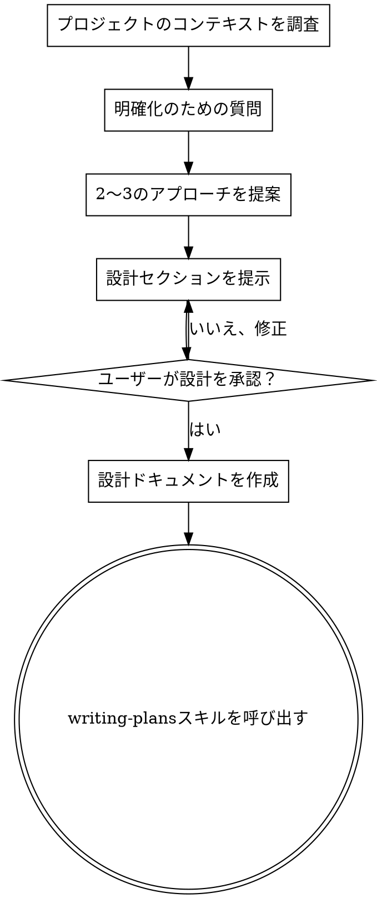

# アイデアを設計に落とし込むブレインストーミング

## 概要

自然な対話を通じて、アイデアを完全な設計・仕様に仕上げる。

まずプロジェクトの現状を理解し、一度に1つずつ質問してアイデアを精緻化する。何を構築するか理解できたら、設計を提示してユーザーの承認を得る。

<HARD-GATE>
設計を提示し、ユーザーが承認するまで、いかなる実装スキルの呼び出し、コードの記述、プロジェクトのスキャフォールド、その他の実装アクションも行ってはならない。これはどんなに簡単に見えるプロジェクトにも例外なく適用される。
</HARD-GATE>

## アンチパターン: 「これは設計するほどでもない」

すべてのプロジェクトがこのプロセスを経る。ToDoリスト、単一関数のユーティリティ、設定変更、すべてである。「簡単な」プロジェクトこそ、検証されていない思い込みが最も多くの手戻りを生む。本当にシンプルなプロジェクトなら設計は数行で済むが、提示して承認を得ることは必須である。

## チェックリスト

以下の各項目に対してタスクを作成し、順番に完了すること：

1. **プロジェクトのコンテキストを調査** — ファイル、ドキュメント、最近のコミットを確認
2. **明確化のための質問** — 一度に1つずつ、目的・制約・成功基準を理解する
3. **2〜3のアプローチを提案** — トレードオフと推奨案を示す
4. **設計を提示** — 複雑さに応じたセクションで提示し、各セクション後にユーザーの承認を得る
5. **設計ドキュメントを作成** — `docs/plans/YYYY-MM-DD-<topic>-design.md` に保存しコミット
6. **実装への移行** — writing-plans スキルを呼び出して実装計画を作成

## プロセスフロー

**終了状態は writing-plans の呼び出しである。** frontend-design、mcp-builder、その他の実装スキルは呼び出さないこと。ブレインストーミング後に呼び出す唯一のスキルは writing-plans である。

## プロセス

**アイデアの理解：**
- まずプロジェクトの現状を確認する（ファイル、ドキュメント、最近のコミット）
- 一度に1つずつ質問してアイデアを精緻化する
- 可能な限り選択式の質問を優先するが、自由回答でも構わない
- 1メッセージにつき1つの質問 — 深掘りが必要な場合は複数の質問に分割する
- 理解すべきポイント：目的、制約、成功基準

**アプローチの探索：**
- トレードオフを含む2〜3の異なるアプローチを提案する
- 推奨案と理由を示しながら、会話形式で選択肢を提示する
- 推奨案を最初に提示し、その理由を説明する

**設計の提示：**
- 何を構築するか理解できたと判断したら、設計を提示する
- 各セクションの分量は複雑さに応じて調整：簡単なら数行、細かい判断が必要なら200〜300語程度
- 各セクション後に「ここまでの内容で問題ないか」を確認する
- カバーする範囲：アーキテクチャ、コンポーネント、データフロー、エラーハンドリング、テスト
- 不明点があれば遡って明確化する用意をする

## 設計後の流れ

**ドキュメント化：**
- 承認された設計を `docs/plans/YYYY-MM-DD-<topic>-design.md` に書き出す
- elements-of-style:writing-clearly-and-concisely スキルがあれば活用する
- 設計ドキュメントを git にコミットする

**実装：**
- writing-plans スキルを呼び出して詳細な実装計画を作成する
- 他のスキルは呼び出さないこと。次のステップは writing-plans のみ。

## 基本原則

- **一度に1つの質問** — 複数の質問で相手を圧倒しない
- **選択式を優先** — 可能な限り、自由回答より選択式のほうが答えやすい
- **YAGNIを徹底** — 不要な機能はすべての設計から排除する
- **代替案の探索** — 決定前に必ず2〜3のアプローチを提案する
- **段階的な検証** — 設計を提示し、承認を得てから次に進む
- **柔軟に対応** — 不明点があれば遡って明確化する
