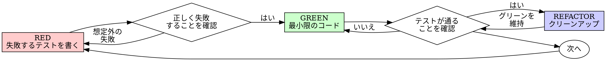

# テスト駆動開発（TDD）

## 概要

まずテストを書く。失敗を確認する。テストを通すための最小限のコードを書く。

**核心原則：** テストが失敗するのを見ていなければ、正しいものをテストしているかわからない。

**ルールの文字に反することは、その精神にも反することである。**

## 使用するタイミング

**常に：**
- 新機能
- バグ修正
- リファクタリング
- 動作変更

**例外（人間のパートナーに確認すること）：**
- 使い捨てのプロトタイプ
- 自動生成されたコード
- 設定ファイル

「今回だけTDDを省略しよう」と思ったら？ 止まれ。それは合理化だ。

## 鉄則

```
失敗するテストなしにプロダクションコードを書いてはならない
```

テストより先にコードを書いてしまった？ 削除して最初からやり直せ。

**例外なし：**
- 「参考」として残さない
- テストを書きながら「調整」しない
- そのコードを見ない
- 削除は削除

テストからまっさらに実装する。以上。

## Red-Green-Refactor



### RED - 失敗するテストを書く

何が起こるべきかを示す、最小限のテストを1つ書く。

<Good>
```typescript
test('retries failed operations 3 times', async () => {
  let attempts = 0;
  const operation = () => {
    attempts++;
    if (attempts < 3) throw new Error('fail');
    return 'success';
  };

  const result = await retryOperation(operation);

  expect(result).toBe('success');
  expect(attempts).toBe(3);
});
```
明確な名前、実際の動作をテスト、1つのことに集中
</Good>

<Bad>
```typescript
test('retry works', async () => {
  const mock = jest.fn()
    .mockRejectedValueOnce(new Error())
    .mockRejectedValueOnce(new Error())
    .mockResolvedValueOnce('success');
  await retryOperation(mock);
  expect(mock).toHaveBeenCalledTimes(3);
});
```
曖昧な名前、コードではなくモックをテストしている
</Bad>

**要件：**
- 1つの振る舞い
- 明確な名前
- 実際のコード（やむを得ない場合を除きモック不使用）

### RED確認 - 失敗を目視する

**必須。絶対にスキップしない。**

```bash
npm test path/to/test.test.ts
```

確認事項：
- テストが失敗する（エラーではない）
- 失敗メッセージが想定通り
- 機能が未実装だから失敗する（タイプミスではない）

**テストが通った？** 既存の動作をテストしている。テストを修正。

**テストがエラーになった？** エラーを修正し、正しく失敗するまで再実行。

### GREEN - 最小限のコード

テストを通すための最もシンプルなコードを書く。

<Good>
```typescript
async function retryOperation<T>(fn: () => Promise<T>): Promise<T> {
  for (let i = 0; i < 3; i++) {
    try {
      return await fn();
    } catch (e) {
      if (i === 2) throw e;
    }
  }
  throw new Error('unreachable');
}
```
テストを通すのに十分なだけ
</Good>

<Bad>
```typescript
async function retryOperation<T>(
  fn: () => Promise<T>,
  options?: {
    maxRetries?: number;
    backoff?: 'linear' | 'exponential';
    onRetry?: (attempt: number) => void;
  }
): Promise<T> {
  // YAGNI（今必要ないものは作らない）
}
```
過剰設計
</Bad>

テストの範囲を超えた機能追加、他のコードのリファクタリング、「改善」はしない。

### GREEN確認 - 成功を目視する

**必須。**

```bash
npm test path/to/test.test.ts
```

確認事項：
- テストが通る
- 他のテストも引き続き通る
- 出力がクリーン（エラー・警告なし）

**テストが失敗？** コードを修正する（テストではなく）。

**他のテストが失敗？** 今すぐ修正。

### REFACTOR - クリーンアップ

グリーンになった後のみ：
- 重複の除去
- 名前の改善
- ヘルパーの抽出

テストをグリーンに保つ。動作は追加しない。

### 繰り返し

次の機能のための次の失敗するテストへ。

## 良いテストの条件

| 品質 | 良い例 | 悪い例 |
|------|--------|--------|
| **最小限** | 1つのことだけ。名前に「and」があるなら分割。 | `test('validates email and domain and whitespace')` |
| **明確** | 名前が動作を説明 | `test('test1')` |
| **意図を示す** | 望ましいAPIを実演 | コードが何をすべきか不明瞭 |

## なぜ順序が重要か

**「後でテストを書いて動作を検証する」**

実装後に書いたテストはすぐに通る。すぐに通ることは何も証明しない：
- 間違ったものをテストしているかもしれない
- 動作ではなく実装をテストしているかもしれない
- 忘れたエッジケースを見落としているかもしれない
- テストがバグを捕捉する瞬間を見ていない

テストファーストは、テストが失敗するのを見ることを強制し、テストが実際に何かを検証していることを証明する。

**「すべてのエッジケースを手動テスト済み」**

手動テストはアドホック。すべてテストしたつもりでも：
- 何をテストしたか記録がない
- コード変更時に再実行できない
- プレッシャー下ではケースを忘れやすい
- 「試したら動いた」≠ 網羅的

自動テストは体系的。毎回同じように実行される。

**「X時間の作業を削除するのは無駄」**

サンクコストの誤謬。時間はすでに過ぎた。今の選択肢は：
- 削除してTDDでやり直す（X時間追加、高い信頼性）
- 残して後からテストを追加（30分、低い信頼性、バグの可能性大）

「無駄」なのは信頼できないコードを維持すること。実質的なテストのない動くコードは技術的負債。

**「TDDは教条的、現実的に適応すべき」**

TDDは現実的である：
- コミット前にバグを発見（デバッグより速い）
- リグレッションを防止（テストが破壊を即座に検知）
- 動作を文書化（テストがコードの使い方を示す）
- リファクタリングを可能にする（自由に変更、テストが破壊を検知）

「現実的な」ショートカット = 本番でのデバッグ = より遅い。

**「後からテストでも同じ目的を達成できる — 儀式より精神だ」**

いいえ。後からのテストは「これは何をするか？」に答える。先のテストは「これは何をすべきか？」に答える。

後からのテストは実装にバイアスされる。構築したものをテストしており、要件をテストしていない。思い出したエッジケースを検証しており、発見したものではない。

先のテストはエッジケースの発見を実装前に強制する。後からのテストはすべてを覚えているか検証する（覚えていない）。

30分の後付けテスト ≠ TDD。カバレッジは得られるが、テストが機能する証明を失う。

## よくある合理化

| 言い訳 | 現実 |
|--------|------|
| 「テストするほど簡単じゃない」 | シンプルなコードも壊れる。テストは30秒で書ける。 |
| 「後でテストする」 | すぐに通るテストは何も証明しない。 |
| 「後からでも同じ目的を達成する」 | 後から = 「何をするか？」 先に = 「何をすべきか？」 |
| 「手動テスト済み」 | アドホック ≠ 体系的。記録なし、再実行不可。 |
| 「X時間を削除は無駄」 | サンクコストの誤謬。未検証コードの維持こそ技術的負債。 |
| 「参考として残し、テストを先に」 | 結局そのコードを調整する。それは後からテスト。削除は削除。 |
| 「まず探索が必要」 | 構わない。探索は捨てて、TDDで始める。 |
| 「テストが難しい = 設計が不明確」 | テストの声を聴け。テストしにくい = 使いにくい。 |
| 「TDDは遅くなる」 | TDDはデバッグより速い。現実的 = テストファースト。 |
| 「手動テストの方が速い」 | 手動はエッジケースを証明しない。変更のたびに再テストが必要。 |
| 「既存コードにテストがない」 | 改善するなら既存コードにもテストを追加。 |

## 警告サイン - 止まってやり直す

- テストより先にコードを書いた
- 実装後にテストを書いた
- テストがすぐに通った
- なぜテストが失敗したか説明できない
- テストを「後で」追加
- 「今回だけ」と合理化している
- 「手動テスト済み」
- 「後からテストでも同じ目的を達成する」
- 「儀式より精神だ」
- 「参考として残す」「既存コードを調整」
- 「X時間費やした、削除は無駄」
- 「TDDは教条的、自分は現実的」
- 「今回は違う、なぜなら...」

**これらすべてが意味すること：コードを削除し、TDDでやり直す。**

## 例: バグ修正

**バグ：** 空のメールアドレスが受け入れられる

**RED**
```typescript
test('rejects empty email', async () => {
  const result = await submitForm({ email: '' });
  expect(result.error).toBe('Email required');
});
```

**RED確認**
```bash
$ npm test
FAIL: expected 'Email required', got undefined
```

**GREEN**
```typescript
function submitForm(data: FormData) {
  if (!data.email?.trim()) {
    return { error: 'Email required' };
  }
  // ...
}
```

**GREEN確認**
```bash
$ npm test
PASS
```

**REFACTOR**
必要に応じて、複数フィールド用にバリデーションを抽出。

## 検証チェックリスト

作業完了の前に確認：

- [ ] すべての新規関数/メソッドにテストがある
- [ ] 各テストが実装前に失敗するのを確認した
- [ ] 各テストが想定通りの理由で失敗した（機能未実装、タイプミスではない）
- [ ] 各テストを通す最小限のコードを書いた
- [ ] すべてのテストが通る
- [ ] 出力がクリーン（エラー・警告なし）
- [ ] テストは実際のコードを使用（やむを得ない場合のみモック）
- [ ] エッジケースとエラーケースをカバー

すべてにチェックできない？ TDDを省略した。やり直し。

## 行き詰まったとき

| 問題 | 解決策 |
|------|--------|
| テスト方法がわからない | 望ましいAPIを書く。アサーションを先に書く。人間のパートナーに聞く。 |
| テストが複雑すぎる | 設計が複雑すぎる。インターフェースを簡素化する。 |
| すべてをモックしなければならない | コードの結合度が高すぎる。依存性の注入を使う。 |
| テストセットアップが巨大 | ヘルパーを抽出する。それでも複雑なら設計を簡素化する。 |

## デバッグとの統合

バグを発見したら？ そのバグを再現する失敗するテストを書く。TDDサイクルに従う。テストが修正を証明し、リグレッションを防止する。

テストなしでバグを修正してはならない。

## テストのアンチパターン

モックやテストユーティリティを追加する際は、@testing-anti-patterns.md を読んでよくある落とし穴を避ける：
- 実際の動作ではなくモックの動作をテストしている
- プロダクションクラスにテスト専用メソッドを追加している
- 依存関係を理解せずにモックしている

## 最終ルール

```
プロダクションコード → テストが存在し、先に失敗していること
そうでなければ → TDDではない
```

人間のパートナーの許可なしに例外はない。
