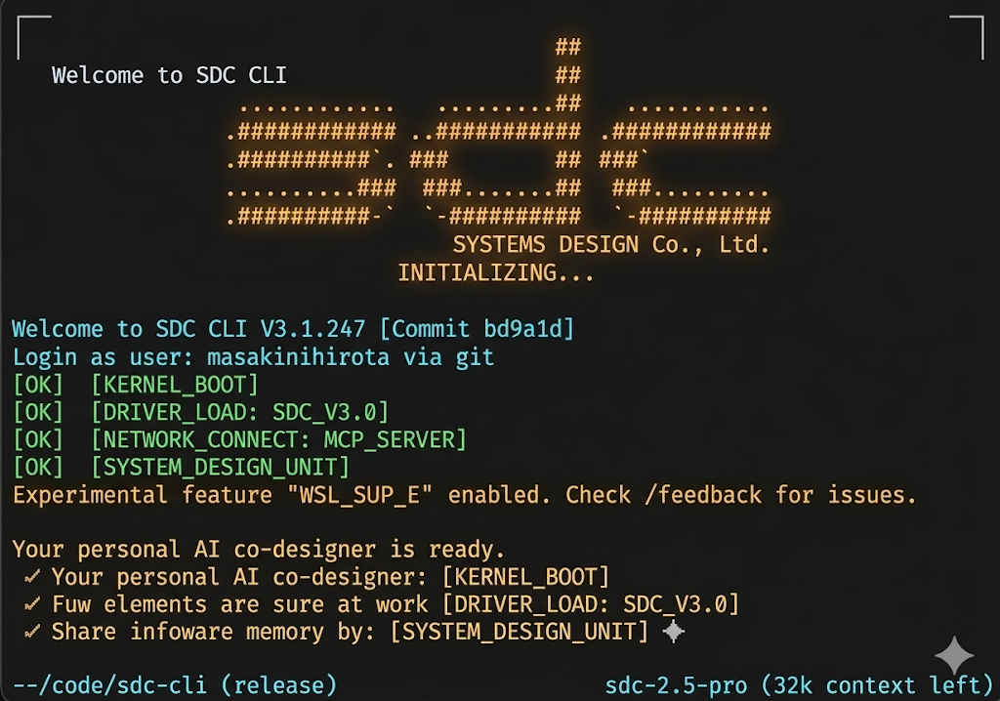

# Multi-Agent Orchestration — マルチエージェント AI 開発基盤



Claude Code をオーケストレーターとして、Codex・Gemini を協調させる **マルチエージェント AI 開発環境** のテンプレートリポジトリです。  
複数の AI エージェントが役割分担しながら並列実行することで、高速・高品質な開発を実現します。

---

## アーキテクチャ

```
┌─────────────────────────────────────────────────────┐
│                  tmux: multi-agent                  │
│                                                     │
│  ┌──────────────────┐  ┌──────────┐  ┌──────────┐  │
│  │ 🤖 Claude Code   │  │ ⚡ Codex │  │ ✨Gemini │  │
│  │  (Orchestrator)  │  │  Agent   │  │  Agent   │  │
│  └──────────────────┘  └──────────┘  └──────────┘  │
│  ┌─────────────────────────────────────────────┐    │
│  │  📊 Output Log (tail -f output.log)         │    │
│  └─────────────────────────────────────────────┘    │
└─────────────────────────────────────────────────────┘
         ↓ JSON タスクキュー / 結果ファイル
   orchestrator/shared/task-queue/
   orchestrator/shared/results/
```

| エージェント | ツール | 役割 |
|-------------|--------|------|
| Claude Code | claude | オーケストレーター：タスク分解・派遣・結果統合 |
| Codex | codex | コード実装・アルゴリズム・データモデル |
| Gemini | gemini | アーキテクチャ設計・調査・テスト・セキュリティ監査 |

---

## 実行フロー

タスクは 3 フェーズで並列処理されます：

```
Phase 1: 設計・調査
  Codex  → 実装計画・コード構造の分析
  Gemini → ベストプラクティス・アーキテクチャ調査
        ↓ 結果統合
Phase 2: 実装
  Codex  → コア機能の実装
  Gemini → テスト戦略・ドキュメント作成
        ↓ 結果統合
Phase 3: レビュー・最適化
  Codex  → バグ発見・改善提案
  Gemini → セキュリティ監査・パフォーマンス分析
        ↓ 最終成果物
```

---

## 前提条件

### 必要なツール

| ツール | 用途 |
|--------|------|
| `tmux` | マルチペイン管理 |
| `claude` | Claude Code CLI（オーケストレーター） |
| `codex` | Codex CLI（コード実装エージェント） |
| `gemini` | Gemini CLI（設計・調査エージェント） |
| `jq` | JSON 処理 |

### 必要な API キー

| 環境変数 | 説明 |
|----------|------|
| `ANTHROPIC_API_KEY` | Claude Code の認証 |
| `OPENAI_API_KEY` | Codex CLI の認証 |
| `GOOGLE_API_KEY` | Gemini CLI の認証 |

依存関係の確認は以下で実行できます：

```bash
bash orchestrator/check-deps.sh
```

---

## セットアップ

```bash
# 1. リポジトリのクローン
git clone <repository-url>
cd Multi-Orchestration

# 2. 環境変数の設定
cp .env.example .env # オーケストレーター
cp .gemini/.env.example .gemeni/.env # Gemini設定
# .env を編集して API キーとモデルを設定
```

### `.env` の設定項目

| 変数 | デフォルト | 説明 |
|------|-----------|------|
| `ANTHROPIC_API_KEY` | — | Claude Code 認証キー |
| `OPENAI_API_KEY` | — | Codex 認証キー |
| `GOOGLE_API_KEY` | — | Gemini 認証キー |
| `ORCHESTRATOR_TIMEOUT` | `180` | エージェント結果待機タイムアウト（秒） |
| `MAX_RETRY` | `3` | タスク失敗時の最大リトライ回数 |
| `CODEX_MODEL` | `codex-1` | Codex が使用するモデル |
| `GEMINI_MODEL` | `gemini-2.5-pro` | Gemini が使用するモデル |
| `TMUX_SESSION` | `multi-agent` | tmux セッション名 |

### 各エージェントの設定ファイル

| ファイル | 説明 |
|----------|------|
| `~/.claude/settings.json` | Claude Code のグローバルパーミッション |
| `.claude/settings.json` | プロジェクトローカルパーミッション |
| `~/.codex/config.toml` | Codex の承認モード・モデル設定 |
| `.codex/AGENTS.md` | Codex エージェントの役割定義・出力形式 |
| `.gemini/system.md` | Gemini のシステムプロンプト |
| `~/.gemini/settings.json` | Gemini のグローバル設定 |

---

## Usage

### 1. tmux セッションの起動

```bash
bash orchestrator/tmux-setup.sh
```

4 ペインの tmux セッション `multi-agent` が起動します：

| ペイン | 役割 |
|--------|------|
| Pane 0 | 🤖 Claude Code (Orchestrator) |
| Pane 1 | ⚡ Codex Agent |
| Pane 2 | ✨ Gemini Agent |
| Pane 3 | 📊 Output Log |

### 2. オーケストレーションの実行

Pane 0（Claude Code Orchestrator）で実行：

```bash
bash orchestrator/orchestrate.sh "タスクの説明"
```

**例:**

```bash
# 認証機能の実装
bash orchestrator/orchestrate.sh "ユーザー認証機能をJWT方式で実装する"

# データベース設計
bash orchestrator/orchestrate.sh "チャット履歴を保存するためのSupabaseスキーマを設計"

# パフォーマンス最適化
bash orchestrator/orchestrate.sh "APIレスポンス時間を改善するキャッシュ戦略を提案"
```

### 3. 結果の確認

```bash
# リアルタイムログ（Pane 3 で自動表示）
tail -f orchestrator/shared/results/output.log

# フェーズ別の統合結果
cat orchestrator/shared/results/merged-phase1.json | jq .
cat orchestrator/shared/results/merged-phase2.json | jq .
cat orchestrator/shared/results/merged-phase3.json | jq .
```

### Hello World サンプルアプリ

`apps/hello_world` にはエージェントの Phase 2 で使用できるシンプルなサンプル機能を用意しています。

```bash
python -m apps.hello_world.cli --target "world" --locale en
```

実行すると JSON 形式で `{"message": "Hello world", ...}` を返すため、`codex-runner.sh` や `gemini-runner.sh` がそのまま結果を取り込めます。

### 4. セッション操作

```bash
# セッションに再接続
tmux attach -t multi-agent

# セッション一覧
tmux ls

# セッション終了
tmux kill-session -t multi-agent
```

---

## Claude Code カスタムコマンド

`.claude/commands/` に定義されたコマンドを `/` プレフィックスで呼び出せます。

### オーケストレーション

| コマンド | 説明 |
|---------|------|
| `/orchestrate` | tmux セッション起動 + オーケストレーション実行 |
| `/dispatch` | 特定エージェントへタスクを単体派遣 |

### 仕様・設計

| コマンド | 説明 |
|---------|------|
| `/specify` | 要件定義書（spec.md）の作成 |
| `/plans` | 実装計画書（PLANS.md）の生成・更新 |
| `/designs` | フロントエンド UI デザインの作成 |

### エージェント設定

| コマンド | 説明 |
|---------|------|
| `/write-claude` | CLAUDE.md の生成・更新 |
| `/interview-claude` | インタビュー形式で CLAUDE.md を作成 |

### テスト

| コマンド | 説明 |
|---------|------|
| `/create-unittest` | 単体テストの作成 |
| `/create-integrationtest` | 結合テストの作成 |
| `/e2e-cli-test` | CLI による E2E テスト実行 |
| `/e2e-mcp-test` | MCP ブラウザによる E2E テスト実行 |

### 開発・運用

| コマンド | 説明 |
|---------|------|
| `/commit` | git コミットメッセージ生成とコミット |
| `/Identifying-todo` | TODO の洗い出し |
| `/save-specdiff` | 仕様の差分を保存 |
| `/changelogs` | 変更ログの生成 |

---

## ディレクトリ構成

```
Multi-Orchestration/
├── orchestrator/
│   ├── tmux-setup.sh          # tmux セッション起動スクリプト
│   ├── orchestrate.sh         # メインオーケストレーター（3フェーズ並列実行）
│   ├── check-deps.sh          # 起動前依存チェック
│   ├── agents/
│   │   ├── codex-runner.sh    # Codex エージェントラッパー
│   │   └── gemini-runner.sh   # Gemini エージェントラッパー
│   ├── lib/
│   │   ├── lock.sh            # ファイル競合防止（排他ロック）
│   │   ├── retry.sh           # リトライ・フォールバック処理
│   │   └── display.sh         # tmux ペインのリアルタイム進捗表示
│   └── shared/
│       ├── task-queue/        # タスクキュー（JSON）  ※ gitignore 済み
│       ├── results/           # 実行結果・ログ        ※ gitignore 済み
│       └── state.json         # フェーズ状態追跡      ※ gitignore 済み
├── .claude/
│   ├── commands/              # カスタムコマンド定義（/orchestrate 等）
│   ├── agents/                # サブエージェント定義
│   ├── rules/                 # エージェントルール
│   ├── skills/                # 再利用可能なスキル集
│   ├── docs/templates/        # ドキュメントテンプレート
│   └── settings.json          # プロジェクトローカルパーミッション
├── .codex/
│   ├── AGENTS.md              # Codex エージェントの役割・出力形式定義
│   ├── config.toml            # Codex 設定（承認モード・モデル）
│   └── skills/                # Codex スキル
├── .gemini/
│   ├── system.md              # Gemini システムプロンプト
│   ├── settings.json          # Gemini モデル設定
│   └── skills/                # Gemini スキル
├── docs/
│   ├── designs/               # UI デザイン（HTML）
│   ├── plans/                 # 実装計画書
│   ├── requirements/          # 要件ドキュメント
│   └── project_info/          # プロジェクト情報テンプレート
├── specs/                     # 仕様書（/specify コマンドで生成）
├── .env                       # 環境変数（git 管理外）
├── .gitignore
└── README.md
```

---

## エージェント間通信プロトコル

### タスクキュー形式（Claude → エージェント）

```json
{
  "prompt": "タスクの内容",
  "phase": "phase1",
  "agent": "codex",
  "dispatched_at": 1234567890
}
```

### 結果形式（エージェント → Claude）

```json
{
  "agent": "codex",
  "phase": "phase1",
  "result": "実行結果のテキスト",
  "success": true,
  "timestamp": 1234567890
}
```

### 堅牢性機能

| 機能 | スクリプト | 説明 |
|------|-----------|------|
| 排他ロック | `lib/lock.sh` | 複数エージェントのファイル競合を防止 |
| リトライ | `lib/retry.sh` | 失敗時に最大 `MAX_RETRY` 回リトライ。全失敗時は Claude が直接処理（フォールバック） |
| 状態追跡 | `shared/state.json` | フェーズごとの進捗・エージェント稼働状況を記録 |
| 進捗表示 | `lib/display.sh` | tmux ペインタイトルをリアルタイムで更新 |

---

## ライセンス

MIT
